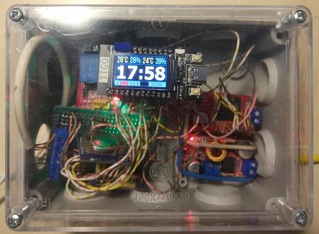

# chiken

##На основе Esphome

### Контроллер TTGO-T-Display ESP32 c экраном st7789v
https://esphome.io/components/display/st7789v.html
### 4 реле через I2C pcf8574
I2C 21,22
### Часы ds1307 через I2C
I2C 21,22
### Управление дверью двигателем постоянного тока через VNH3SP30
Enable 25, ENA 26, ENB 27, PWM 33 (platform: ledc)
### AM2302 №1
Pin 15. Температура заведена на climate, platform: bang_bang, выход Реле 1
### AM2302 №2
Pin 13. Температура заведена на climate, platform: bang_bang, выход Реле 2
